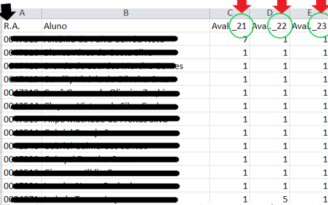

# meuIFMG++

Uma extensão para o Google Chrome que adiciona novas funcionalidades ao sistema Conecta (meu.ifmg.edu.br).

## Algumas justificativas para a criação desta extensão
1. Geralmente mantemos todas as notas em uma planilha. E somente depois lançamos no sistema. 
2. É mais simples manter a planilha atualizada do que o sistema. **Com a extesão ficou bem simples manter ambos sincronizados**. 
3. Quando estamos lançando as notas geralmente dividimos a tela do PC: de um lado uma planilha com as notas e do outro a tela de lançamento do sistema. É muito fácil errar alguma nota de algum aluno e depois ter que refazer tudo novamente.
4. Além de algumas outras situações que podem ocorrer quando estamos lançando as notas no sistema. Por exemplo, a conexão cai e então temos que lançar nota por nota novamente; ou passamos do tempo que o sistema permite para o lançamente e, novamente, lançar nota por nota. 

## Como usar
### No lançamento de notas de avaliações

1. Digite suas notas em uma planilha e salve com a extensão ".xlsx" ou ".xls" ou salve em uma planilha a partir do Conecta (botão "Gerar excel").
2. Dentro da planilha você deverá seguir algumas regrinhas para a confecção do cabaçalho (primeira linha) do arquivo (Figura 1).
3. Para as avaliações crie colunas conforme as setas Vermelhas e utilize o mesmo "Cód. Prova" (circulados de verde na imagem) criado para suas avaliações no Conecta (Figura 1).
4. Você também deve informar em uma coluna com o título R.A. (seta preta) todos os registros acadêmicos dos alunos (Figura 1).

### No lançamento de planos de aula
1. Digite seus planos em uma planilha e salve com a extensão ".xlsx" ou ".xls" ou salve em uma planilha a partir do Conecta (botão "Gerar excel").
2. Dentro da planilha você deverá seguir algumas regrinhas para a confecção do cabaçalho (primeira linha) do arquivo (Figura 2).
3. Para as colunas de conteúdo use o nome "Conteúdo previsto" e "Conteúdo realizado" exatamente como no Conecta. Setas vermelhas (Figura 2). Isso é necessário para que a extensão consiga buscar corretamente os conteúdos na planilha. As demais colunas não são utilizadas, mas não recomendamos sua alteração.

### Veja uma demonstração
1. [Lançamento de notas de avaliação](https://drive.google.com/file/d/1CxNok0qEwBecSeA7ShRRc1pha4BJLA3W/view?usp=sharing)
2. [Lançamento de planos de aula](https://drive.google.com/file/d/1RD-Kt3GyJheaDhxqbP-v4NnTKyGty18m/view?usp=sharing)

## Algumas observações

### No lançamento de notas de avaliações
1. Observar o valor máximo de uma avaliação. Se uma nota de algum estudante ultrapassar o valor máximo da avaliação o Conecta não permirá o salvamento das notas. Para resolver, caso essa situação venha a ocorrer, atualize a nota do(s) estudante(s) na página de lançamento do sistema ou volte na planilha e corrija a(s) nota(s), salve a planilha e faça o procedimento de importação (botão verde "Buscar notas") das notas novamente. Em seguida, basta conferir e salvar. 
2.  Observar que o Conecta considera apenas uma casa decimal nas notas. Caso essa situação ocorra na planilha, a extensão fará o arredendamento normal da nota. Ex.: Se na planilha a nota estiver assim: "10,486", ao usar o botão "Buscar notas" essa nota será inserida no conecta já arredondada para "10,5". De qualquer forma, faça uma breve verificação das notas após a importação e antes de pressionar o botão "Salvar".

### No lançamento de planos de aula
1. Essa funcionalidade fará o lançamento de todos os planos de aula registrados na planilha. Caso um plano seja inserido em uma data errada o docente poderá, após o salvamento do coenteúdo de todos os dias, fazer a correção/atualização dessa informação usando normalmente as funções do sistema Conecta. 
2. O Lançamento de planos é realizado como se fosse uma pessoa digitando as informações e clicando nos botões. E isso levará um tempo. Não tão longo quanto uma pessoa, mas não é tão rápido quanto o lançamento de notas pois, nesse caso, a cada dia de aula lançado, o botão salvar é acionado. Portanto, quando inicar o lançamento de plano de aula por essa extensão não utilize a tela até que o procedimento seja concluído. 
3. Se, por algum motivo, precisar cancelar a ação após iniciada, basta presionar a telca "F5" ou o botão "Recarregar página" do Navegador. O que já estiver salvo permanecerá salvo, mas podendo ser excluído ou alterado normalmente. 

## Notas da Versão 0.0.3

### Correções/melhorias adicionadas
- Arredondamento automático da nota (da planilha) para uma casa decimal (conforme é aceito pelo Conecta).

### Novas funcionalidades adicionadas nessa versão
- Salvar plano de aula em uma planilha.
- Lançar plano de aula a partir de uma planilha.

